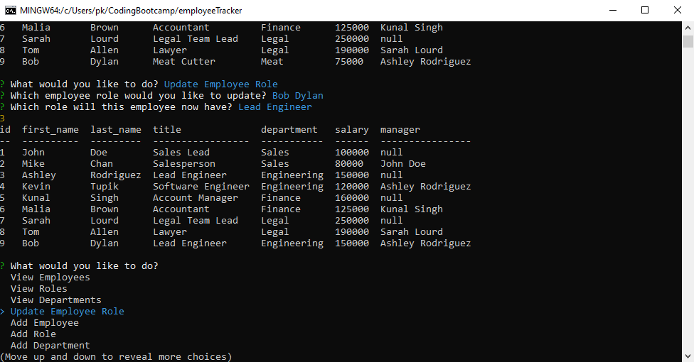

# Employee Tracker

A command line application is made to store data in a database for employees for a company. The user is able to add/view departments, roles, employees and update employees role.

# Links

- Demo for CLI application. https://drive.google.com/file/d/1iMBhzy8Fz4ZgpCWQAOu4wVYuflQiFP0r/view
- Link for the Github repository. https://github.com/phakpa/employeeTracker

# Images

